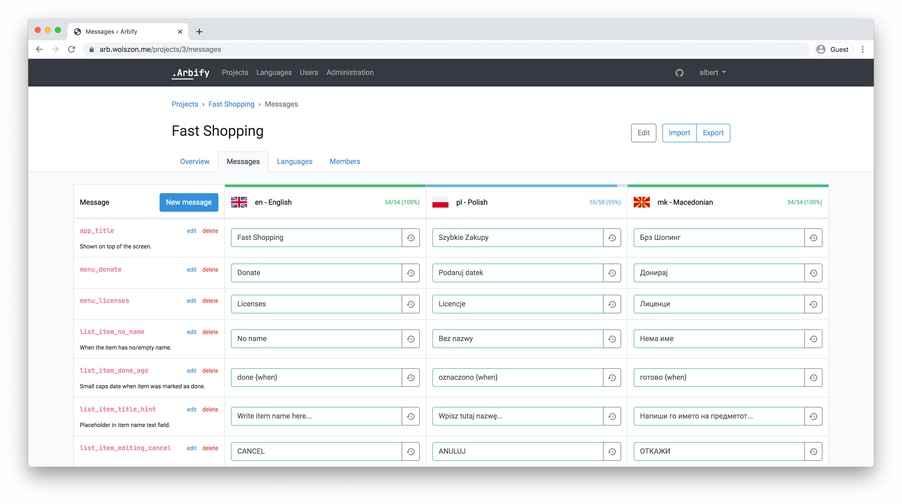

<div align="center">
<h1>Arbify</h1>
    
[![PHP workflow][php-workflow-badge]][php-workflow]


**Arbify is currently abandoned. Features that are already present should work without a problem, but no further support or development will be made here, at least for some time. Feel free to fork it!**

</div>




ARB files localization tool. Dedicated to [Flutter](https://flutter.dev) and its [intl](https://pub.dev/packages/intl) package.

## Installation

Firstly, copy the `.env.example` file to `.env` and fill it with the correct configuration for some of the services.

```bash
cp .env.example .env
nano .env # or vim or whatever you like :)
```

Commented lines are irrelevant, or you most probably shouldn't care about them. You may want to set `MAIL_*` variables
to use a proper SMTP server. Arbify logs the emails instead of sending them by default.

### Deploying

```bash
docker-compose build arbify
docker-compose up -d
docker-compose run --rm arbify docker/arbify/upgrade.sh
```

The `build` step and running the `upgrade.sh` script is required only after installing or updating the Arbify. You don't need to run it everytime.

After this you're ready to go to [http://localhost:8000](http://localhost:8000) and check out Arbify yourself!

The database is seeded with a pre-verified super administrator account `admin` with password `password`.

[php-workflow]: https://github.com/Arbify/Arbify/actions?query=workflow%3APHP
[php-workflow-badge]: https://img.shields.io/github/workflow/status/Arbify/Arbify/PHP
